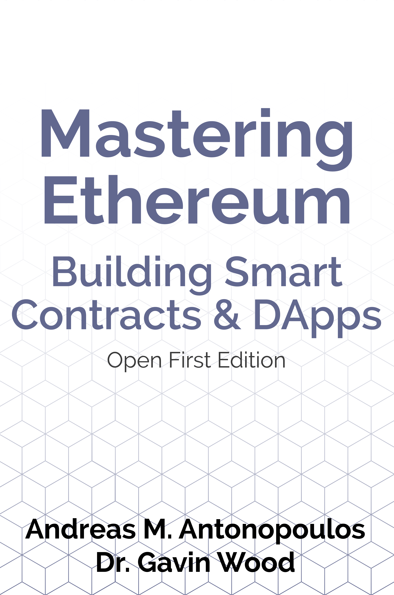

# MasterEthereumChineseOpenEdition - 《精通以太坊》中文开放版

大佬侯俊杰曾在他的著作《深入浅出MFC 2e》中以“勿在浮沙建高台”为第1篇的标题，共勉之！

此中文版动态跟踪[Master Ethereum](https://github.com/ethereumbook/ethereumbook/)的开放版分支的最新提交，后续将不断迭代订正并同步。

### 封面

## 目录

### [前言](preface_open_edition_cn.asciidoc)
### [简明词汇⽬录](glossary_cn.asciidoc)
### [第一章：什么是以太坊](01what-is_cn.asciidoc)
### [第二章：以太坊基础](02intro_cn.asciidoc)
### [第三章：以太坊客户](03clients_cn.asciidoc)
### [第四章：密码学](04keys-addresses_cn.asciidoc)
### [第五章：钱包](05wallets_cn.asciidoc)
### [第六章：交易](06transactions_cn.asciidoc)
### [第七章：智能合约和Solidity](07smart-contracts-solidity_cn.asciidoc)
### [第八章：智能合约和Vyper语⾔](08smart-contracts-vyper_cn.asciidoc)
### [第九章：智能合约的安全问题](09smart-contracts-security_cn.asciidoc)
### [第十章：通证](10tokens_cn.asciidoc)
### [第十一章：预⾔机](11oracles_cn.asciidoc)
### [第十二章：去中⼼化应⽤程序（DApps）](12dapps_cn.asciidoc)
### [第十三章：以太坊虚拟机](13evm_cn.asciidoc)
### [第十四章：共识](14consensus_cn.asciidoc)
### [附录A：以太坊分叉历史](appdx-forks-history_cn.asciidoc)
### [附录B：以太坊标准](appdx-standards-eip-erc_cn.asciidoc)
### [附录C：以太坊虚拟机EVM操作码和所需燃料gas量](appdx-evm-opcodes-gas_cn.asciidoc)
### [附录D：开发⼯具，开发框架和库](appdx-dev-tools_cn.asciidoc)
### [附录E：web3.js教程](appdx-web3js-tutorial_cn.asciidoc)
### [附录F：本书短链接引用](appdx-shortlinks_cn.asciidoc)

## 迭代流程
### openedition ===> open ---> en_cn <--- cn ---> master
